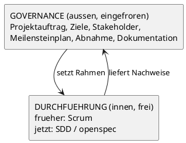
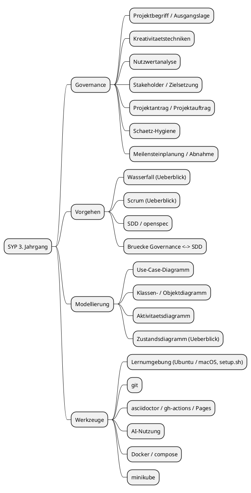

# Design: Curriculum SYP 3. Jahrgang

## Context

Motivation siehe `proposal.md` — Why.

Randbedingungen, die den Entwurf bestimmen:

- **30 Unterrichte à 3 UE**, Standardaufteilung 1 UE Theorie + 2 UE Praxis.
  Erfahrungsgemäß fallen ~5 Termine durch externe Veranstaltungen aus.
- **Governance ist gesetzt.** Projektantrag, Projektauftrag und Meilensteinplan sind in
  allen drei Projektformen (Jahresprojekt 3. Jg, zweijähriges Projekt 4./5. Jg,
  Diplomarbeit) verpflichtend. Der DA-Antrag verlangt zusätzlich eine Aufwandsschätzung
  in Stunden und eine Zuordnung „Verantwortlich" je Schüler.
- **Der DA-Antrag ist vorgehensmodell-neutral.** Er fragt nach Ausgangslage, Zielsetzung,
  Untersuchungsanliegen, geplantem Ergebnis, Meilensteinen und Terminen — nirgends nach
  Sprints, Phasen oder Iterationen.
- **Projektarbeit findet zu Hause statt.** Im Unterricht bleiben ~7 UE für Reviews und
  Hilfestellung.
- **Heterogene Geräte**: überwiegend Windows-Laptops, einzelne Macs.
- Quellenlage: Manz-Schulbuch (nur Textinhalte, keine Abbildungen), PUMA-Material zu
  Kreativitätstechniken und Nutzwertanalyse, UML-Skripten Uni Heidelberg,
  eigene Keynote zu Vorgehensmodellen.

## Goals / Non-Goals

**Goals:**

- Ein Curriculum, das die reale Arbeitsweise (spec-driven mit AI-Agenten) abbildet, ohne
  die für Diplomarbeit und Berufspraxis nötige Governance-Kompetenz zu verlieren
- Eine Unterrichtssequenz, die durch die Werkzeugabhängigkeiten begründet ist, nicht durch
  die Kapitelreihenfolge eines Lehrbuchs
- Ein Jahresrahmen, der Terminausfälle verkraftet, ohne dass Kerninhalte entfallen
- Eine einheitliche, vom Lehrenden beherrschte Lernumgebung

**Non-Goals:**

- Kein Ersatz der Governance-Artefakte durch openspec-Artefakte — sie koexistieren
- Keine Bindung des Curriculums an ein bestimmtes Tool; openspec ist die aktuelle Instanz
  eines Prinzips, nicht der Lerngegenstand selbst
- Keine vollständige UML-Ausbildung; Überblicksniveau genügt für das 3. Jg
- Keine Werkzeugvorgabe für die Schüler jenseits von Ubuntu-LTS bzw. macOS

## Decisions

### D1 — Zweiteilung Governance / Durchführung

Governance (außen, eingefroren, verpflichtend) wird von der Durchführung (innen, frei
wählbar) getrennt. Klassisches Projektmanagement ist damit kein „Vorgehensmodell", das mit
SDD konkurriert, sondern eine eigene Ebene.



*Alternative:* SDD als Ersatz für klassisches PM lehren. Verworfen — die Governance ist
formal vorgeschrieben und wäre im 4./5. Jg nachzuholen.

*Alternative:* Bei Scrum bleiben. Verworfen — Story Points und Velocity setzen eine
Schätz- und Taktökonomie voraus, die durch Agenteneinsatz und Schuljahresrhythmus nicht
mehr trägt.

### D2 — `specs/` ersetzt das Pflichtenheft, der Projektauftrag bleibt Beurteilungsanker

Das Pflichtenheft entfällt. Der Soll-Zustand wird als `specs/<capability>/spec.md`
formuliert und durch `changes/` fortgeschrieben. Beurteilt wird gegen den eingefrorenen
Projektauftrag, gebaut wird gegen die specs.

| Antragsfeld (DA / Projektauftrag) | openspec-Artefakt |
|---|---|
| Ausgangslage | `openspec/config.yaml` → `context:` |
| Zielsetzung | Menge der `specs/` (Capabilities) |
| Individuelle Themenstellung je Schüler | Zuschnitt der `changes/` je Schüler |
| Untersuchungsanliegen | `proposal.md` → Why / offene Fragen |
| Geplantes Ergebnis | `spec.md` → Requirements + Scenarios |
| Meilenstein + Datum | Change archiviert bis Datum |
| Spalte „Verantwortlich" | Change-Ownership + git-Historie |
| Projektfortschritt | `openspec list` / `openspec status` |

*Begründung:* Ohne fixierten Vergleichspunkt könnte ein Team die specs unterwegs an das
anpassen, was fertig geworden ist, und wäre per Definition vollständig. Die Differenz
zwischen Projektauftrag und Endstand wird durch `changes/archive/` sichtbar und ist selbst
Lerngegenstand (Scope-Management).

*Optional:* Initiale Spec-Menge per git-Tag (`baseline-v1`) markieren — das „Pflichtenheft"
ist dann ein `git diff` entfernt.

### D3 — Vorgehensmodelle als drei Taktfrequenzen desselben Musters

Wasserfall, Scrum und SDD werden nicht als konkurrierende Schulen gelehrt, sondern als
Instanzen eines invarianten Musters (Ziel klären → Scope abgrenzen → Anforderung präzise
formulieren → bauen → verifizieren → Änderung kontrolliert einbringen) mit
unterschiedlichem Takt: Monate / Wochen / Minuten.

*Begründung:* Erlaubt es, Wasserfall und Scrum ehrlich kurz zu halten (je 1–2 UE), ohne den
Schülern das Vokabular zu nehmen, das sie in Diplomarbeit und Betrieb brauchen. Macht SDD
begründbar statt behauptet.

### D4 — UML von 8 UE auf 5 UE

Bleiben: Use-Case-, Klassen- (inkl. Objekt-) und Aktivitätsdiagramm. Zustandsdiagramm nur
im Überblick. Deployment-Diagramm wandert in den 4. Jg, wo es inhaltlich zum
Kubernetes-Block gehört. Darstellung durchgängig PlantUML.

*Trade-off:* Finanziert den neuen Brücken-Block. Objektdiagramm kostet neben dem
Klassendiagramm fast nichts; Zustandsdiagramme sind in 3.-Jg-Projekten selten tragend.

### D5 — Schätz-Hygiene statt Schätzverfahren

Function Points, COCOMO und Planning Poker entfallen. Stattdessen 1 UE: Zerlegen schlägt
Schätzen, Bandbreite statt Punktwert (Drei-Punkt), Schätzung ≠ Zusage ≠ Zielvorgabe,
Planning Fallacy, verschobene Unsicherheit bei Agenteneinsatz. Kalibrierung läuft gratis
über die Meilenstein-Reviews (geschätzt vs. tatsächlich).

*Begründung:* Parametrische Verfahren brauchen Kalibrierungsdaten, die Schüler nicht haben;
Velocity braucht stabile Sprints, die es im Schuljahr nicht gibt. Alle klassischen Verfahren
schätzen im Kern Implementierungsaufwand — genau den Posten, der durch Agenteneinsatz
geschrumpft ist. Verbleibende Unsicherheit liegt im Spezifizieren, Reviewen, Integrieren.

*Restrisiko:* Fragenkatalog und Manz-Buch nennen die Verfahren. Abgedeckt durch 10 Minuten
Namenskenntnis und Einordnung, keine Anwendungskompetenz.

### D6 — Kreativitätstechniken und Nutzwertanalyse als Paar

Divergieren (U3) und Konvergieren (U4) werden gekoppelt und jeweils sofort angewendet.
6-3-5 Brainwriting als die eine real durchgeführte Technik: erzeugt schriftliche Ergebnisse
(direkt Rohmaterial für die Projektanträge), alle beteiligen sich, ist durch Konstruktion
zeitgeboxt. Weitere Techniken nur benannt und eingeordnet.

Die Nutzwertanalyse macht die Projektauswahl kriterienbasiert und nachvollziehbar statt
willkürlich; die Schüler legen Kriterien und Gewichte selbst fest.

*Alternative:* Kreativitätstechniken in einen Praxis-Slot. Verworfen — Ideenfindung braucht
keinen Rechner, und die Praxis-Slots am Jahresanfang sind mit git belegt, das auf dem
kritischen Pfad liegt.

### D7 — Lernumgebung: Ubuntu-Partition oder macOS, kein WSL2

Ubuntu 24.04 LTS als Dual-Boot-Partition (≥ 100 GB) oder macOS. Ein klassenweites
`setup.sh` mit `apt`- und `brew`-Zweig etabliert den Standard.

*Begründung:* Der Gewinn ist Umgebungsisolation, nicht Didaktik — eine saubere, einheitliche
Partition gegenüber N unterschiedlich verkonfigurierten Windows-Installationen. „Works on my
machine" verschwindet als Fehlerklasse.

*Alternative:* WSL2. Verworfen — WSL2 sitzt auf Windows und erbt dessen Fehlkonfiguration
(BIOS-Virtualisierung, Hyper-V-Features, Antivirus). Bei kaputtem Windows kein Fallback.

*Überbrückung* statt Fallback: Ubuntu-Live-USB mit Persistenz. Bootet unabhängig vom
Windows-Zustand, braucht keine Partitionsänderung und beweist vorab, dass die Hardware
Linux bootet.

Ergänzungen zur Installationsanleitung: BitLocker-Recovery-Key **vorher** sichern,
Windows-Schnellstart deaktivieren, SATA-Modus auf AHCI prüfen (Intel RST), Secure Boot
beachten, Partition ≥ 100 GB, RAM ≥ 8 GB (16 empfohlen), Virtualisierung im BIOS aktivieren.

### D8 — asciidoctor, GitHub Actions und Pages in den git-Block integrieren

```
git I-IV               8 UE   Repo/Commit/Push, Branch/Merge, PR/Review, Konflikte
asciidoctor            2 UE   Syntax, Struktur, PlantUML-Einbindung
gh-actions + gh-pages  2 UE   Pipeline adoc -> HTML -> Pages
revealjs               2 UE   just-in-time vor der ersten Praesentation
```

*Begründung:* CI ohne Anwendungsfall bleibt abstrakt; „mein `.adoc` wird beim Push zur
Website" ist die kleinste sinnvolle Pipeline. Projektdokumentation fällt als Nebenprodukt
ab, statt am Jahresende zu entstehen. `ubuntu-latest` wird zur neutralen Instanz zwischen
Linux- und macOS-Geräten (Case-Sensitivity, Architektur).

### D9 — Reserve am Ende, gefüllt mit dem verzichtbarsten Inhalt

U26–U30 sind Reserve und tragen minikube. Fallen Termine aus, entfällt automatisch das
Entbehrlichste; Kerninhalte bleiben unberührt. Kubernetes wird im 4. Jg ohnehin vertieft
(dort Deployment in echte Cloud, im 3. Jg nur minikube lokal).

*Alternative:* Reserve gleichmäßig verteilen. Verworfen — dann trifft ein Ausfall zufälligen
Stoff statt des geplant Entbehrlichen.

### D10 — Sequenz folgt der Werkzeugkette

```
git  -->  AI-Grundlagen  -->  openspec  -->  specs statt Pflichtenheft
```

Der Projektstart ist nicht durch die Theorie begrenzt, sondern durch die Werkzeugverfügbarkeit.
Die Lücke zwischen Projektauftrag (HÜ nach U6) und Baseline-specs (HÜ nach U10) füllt sich
mit genau der Theorie, die erklärt, *warum* jetzt specs statt Pflichtenheft kommen.

Die tiefen AI-Themen (Harness Engineering, Loops, agentische Muster) liegen bewusst nach U10,
wenn die Schüler AI bereits am eigenen Projekt einsetzen.

## Jahresrahmen

```
30 Unterrichte x 3 UE = 90 UE geplant
   U1     Vorstellungseinheit                    3 UE
   U2-U25 Kernbetrieb                           72 UE  = 24 T / 48 P
   U26-30 Reserve / Ausfallpuffer               15 UE
```

**Theorie ~25 UE**

| Block | UE |
|---|---|
| Governance (Projektbegriff, Ausgangslage, Kreativitätstechniken, Nutzwertanalyse, Stakeholder, Zielsetzung, Projektauftrag, Schätz-Hygiene, Meilensteinplanung, Abnahme) | 8 |
| Vorgehensmodelle-Überblick (Wasserfall / Scrum / SDD) | 3 |
| SDD / openspec vertieft | 5 |
| Brücke Governance ↔ SDD | 2 |
| Was ist Software-Engineering | 1 |
| UML | 5 |
| Reserve / Leistungsfeststellung | 1 |

**Praxis ~50 UE**

| Block | UE |
|---|---|
| git + asciidoctor + gh-actions/Pages | 14 |
| AI (Grundlagen + Vertiefung) | 15 |
| Docker (inkl. Multi-Arch) | 8 |
| docker compose | 6 |
| Projektbetreuung / Meilenstein-Reviews | 7 |
| minikube *(Reserve-Zone)* | 6 |

## Eröffnungssequenz

```
U1   VORSTELLUNGSEINHEIT (3 UE)
     Ueberblick Stoffgebiet (PlantUML-Mindmap), Organisation, Bewertung,
     Werkzeugkette (warum Linux, warum git, warum Doku als Code),
     Linux: Live-USB-Test -> Installation -> setup.sh,
     Hardware-Checkliste (RAM, Platz, Virtualisierung, Recovery-Key)
     HUE: Live-USB testen, dann installieren

U    THEORIE (1 UE)                    PRAXIS (2 UE)                HUE
--   --------------------------------  ---------------------------  --------------
 2   Projektbegriff, Ausgangslage      git I  (+30 min Trouble-      --
                                       shooting Setup)
 3   Kreativitaetstechniken (6-3-5)    git II: branch, merge        Projektantrag
 4   Nutzwertanalyse -> Auswahl,       git III: PR, review          --
     Teambildung
 5   Stakeholder + Zielsetzung         git IV: conflicts, remotes   --
 6   Projektauftragsstruktur           asciidoctor Grundlagen       Projektauftrag
 7   Vorgehensmodelle-Ueberblick       gh-actions -> gh-pages       --
 8   SDD: warum specs                  AI I: Grundlagen, Prompting  --
 9   BRUECKE Auftrag <-> specs         AI II: Kontext, Continuation --
10   --                                openspec I+II                Baseline-specs
--------------------------------------------------------------------------------
     ab U11: Projekt laeuft, restliche Theorie just-in-time
```

Der Projektantrag wird als `.adoc` im eigenen Repo geschrieben — git-Praxis und
Governance-Hausübung fallen zusammen.

## Stoffstruktur (Übersicht)



## Risks / Trade-offs

| Risiko | Mitigation |
|---|---|
| Linux-Installation scheitert bei einzelnen Schülern und blockiert die Praxis ab U2 | Live-USB-Test **vor** dem Partitionieren; 30 min Troubleshooting-Puffer in U2; `setup.sh` reduziert Folgefehler; Recovery-Key-Pflicht in der Checkliste |
| specs driften mit dem Ist-Stand, Beurteilbarkeit geht verloren | Projektauftrag eingefroren als Beurteilungsanker; optionaler git-Tag `baseline-v1`; `changes/archive/` als Änderungsnachweis |
| openspec ist ein junges Tool und ändert sich | Prinzip (SDD) ist Lerngegenstand, Tool ist die aktuelle Instanz; Curriculum-Struktur benennt das Prinzip, nicht das Kommando |
| Fragenkatalog / Matura fragt klassische Schätzverfahren ab | 10 Minuten Namenskenntnis und Einordnung im Governance-Block |
| Apple Silicon erzeugt arm64-Images, die im 4. Jg beim Cloud-Deployment brechen | Multi-Arch im Docker-Block explizit behandeln; `ubuntu-latest` in CI als Schiedsrichter |
| macOS-Standarddateisystem ist case-insensitiv → „bei mir geht's"-Fehler in gemischten Teams | CI auf `ubuntu-latest` als verbindliche Instanz, ab U7 verfügbar |
| Governance-Artefakte als Hausübung → schwache Qualität | Struktur-UE unmittelbar davor; Review im folgenden Unterricht; Nutzwertanalyse macht Antragsqualität sichtbar |
| Terminausfälle fressen Kerninhalte | Reserve am Ende, gefüllt mit minikube (D9) |
| Praxis-Slots am Jahresanfang vollständig durch git belegt | Ideenfindung braucht keinen Rechner und läuft im Theorie-Slot (D6) |

## Einführungsplan

1. Threads 2–5 klären: Speicherformat der Stoffstruktur, Publikationswege, Rechtslage
   Schulbuch, Detaillierungsgrad der Lernressourcen
2. `specs/` je Capability aus `proposal.md` schreiben (Lernziele als prüfbare Requirements)
3. `tasks.md` ableiten: Erstellung der Lernressourcen auf Englisch, `setup.sh`,
   Vorlagen-Repository für Schülerprojekte
4. Fragenkatalog-Umbau als eigener Change

## Open Questions

- Schätzverfahren doch aufnehmen? Betrifft 1 UE Detailinhalt im Governance-Block und ändert
  weder Sequenz noch Budget. Entscheidung bei der Detailausarbeitung.
- Feinaufteilung der 15 AI-UE zwischen Grundlagen (vor U10) und Vertiefung (nach U10).
- Genauer Zeitpunkt des revealjs-Blocks — abhängig vom Termin der ersten
  Meilenstein-Präsentation.
- Ob die 3.-Jg-Governance-Artefakte formal an die DA-Antragsstruktur angelehnt werden
  sollen, damit die Schüler im 5. Jg ein bekanntes Formular ausfüllen.
